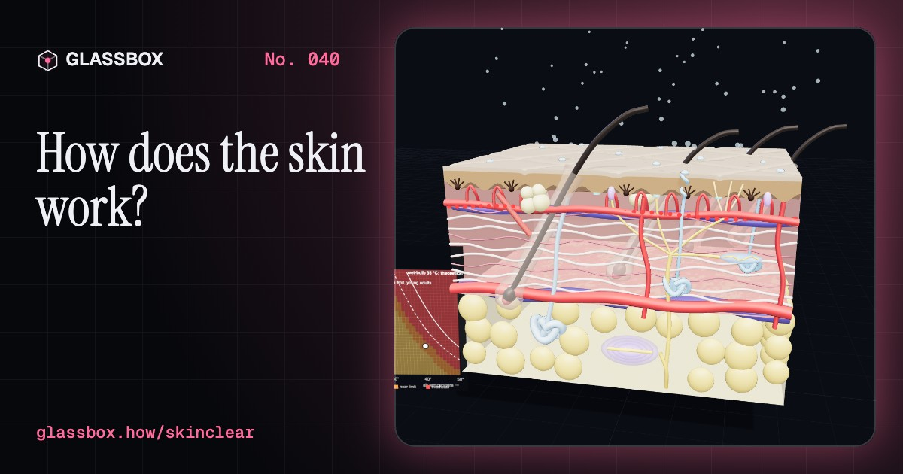
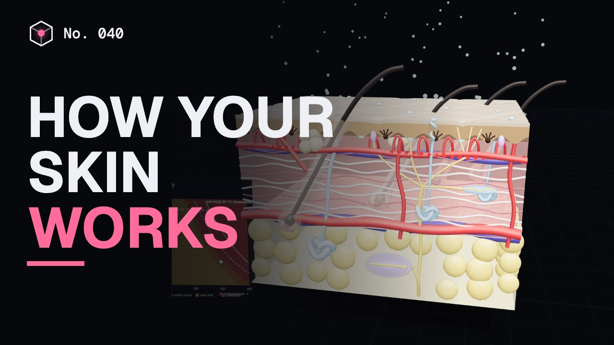
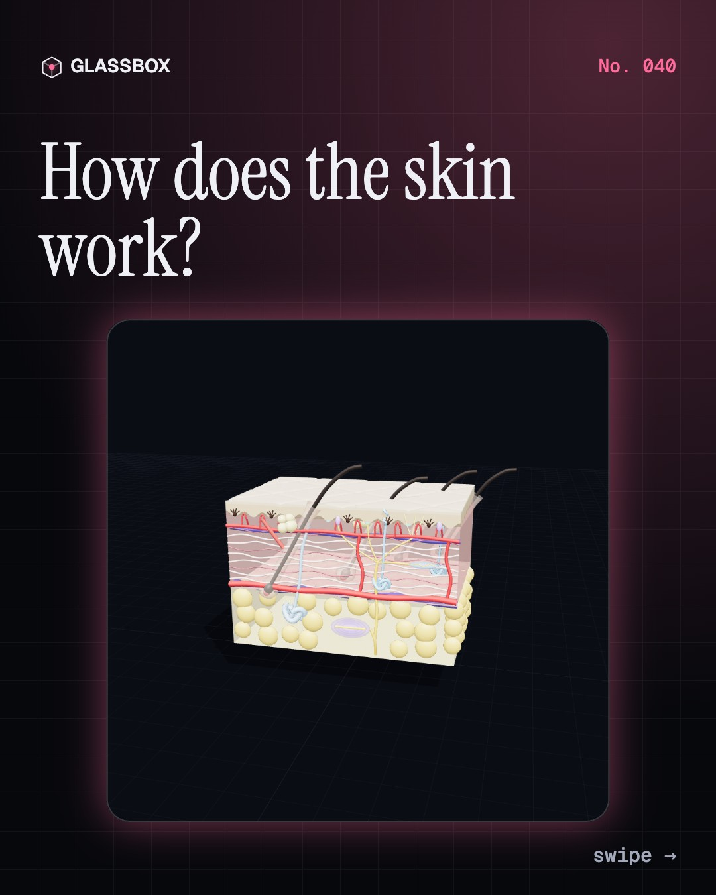
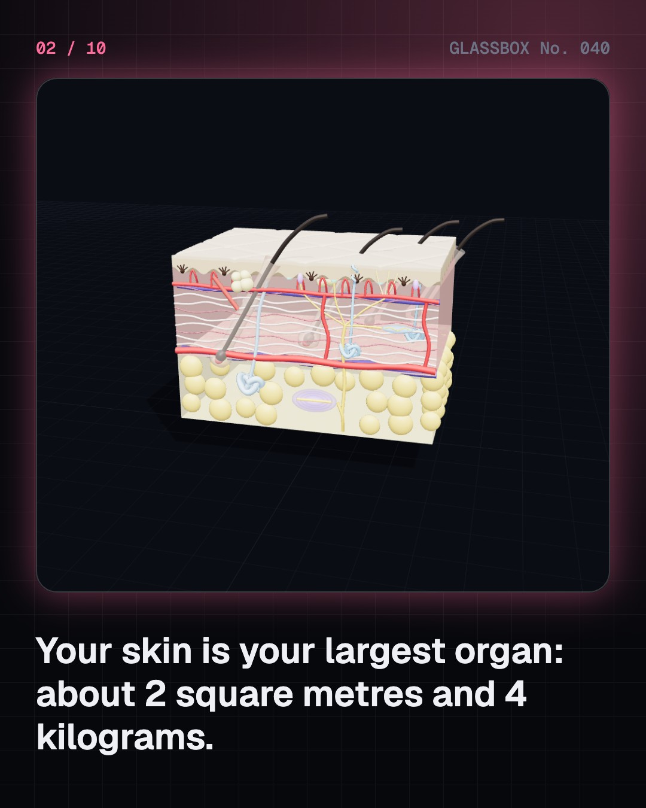
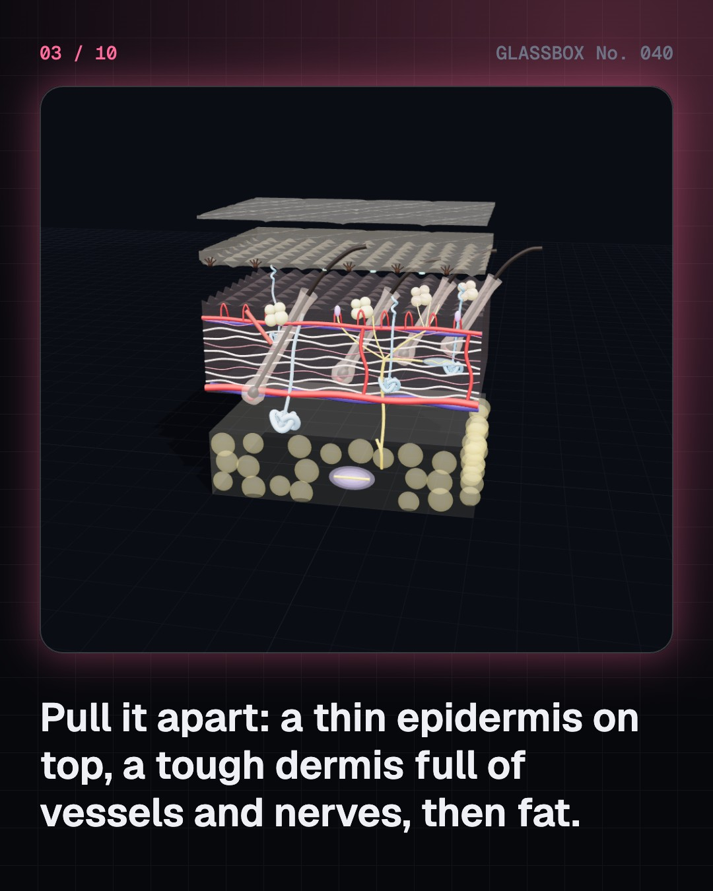
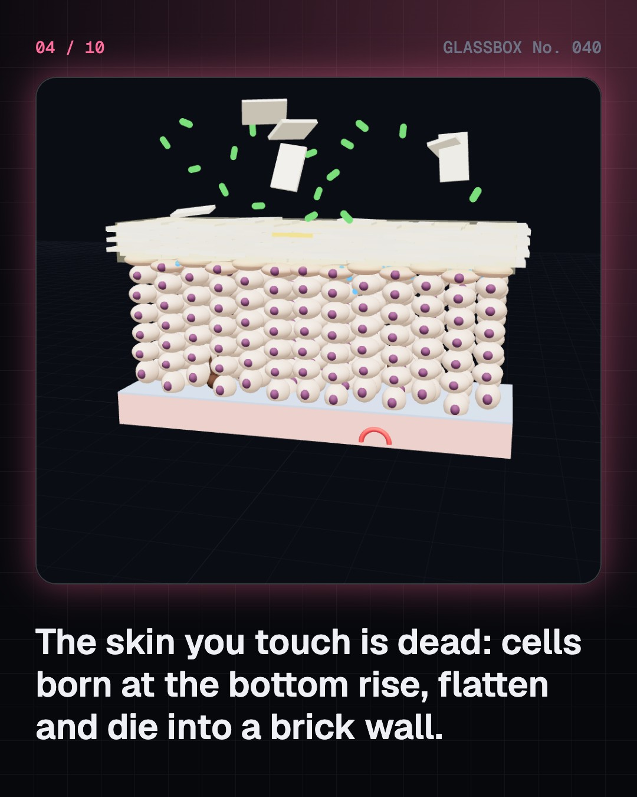

<!-- glassbox:start -->
<!-- Generated from glassbox.json by the Glassbox hub (npm run readme -- skinclear). Edit glassbox.json, not this block. -->
<p align="center"><a href="https://glassbox-production-fd52.up.railway.app/e/skinclear/"></a></p>

<h1 align="center">SkinClear</h1>

<p align="center"><b>How does the skin work?</b><br>Your skin is your largest organ: about 2 square metres that keeps water in, germs out and your core at 37 °C. Cut open a block of it, follow a cell from birth to flake, sweat through a humid heatwave, feel with five kinds of sensor, and see why skin comes in every shade.</p>

<p align="center"><a href="https://glassbox-production-fd52.up.railway.app/skinclear/"><b>▶ Play with it</b></a> &nbsp;·&nbsp; <a href="https://glassbox-production-fd52.up.railway.app/e/skinclear/">Read the 60-second explainer</a> &nbsp;·&nbsp; <a href="https://glassbox-production-fd52.up.railway.app/skinclear/glassbox/reel.mp4">Watch the 40-second video</a></p>

<p align="center">
  <a href="https://glassbox-production-fd52.up.railway.app/e/skinclear/"></a>
  <a href="https://glassbox-production-fd52.up.railway.app/e/skinclear/"></a>
  <a href="LICENSE"></a>
  <a href="LICENSE-CONTENT.md"></a>
  <a href="#privacy"></a>
</p>

## In 60 seconds

1. **Three layers, one big organ.** Skin covers about 1.5 to 2 m² and weighs about 3.5 to 4 kg. On top is the thin epidermis, about 0.1 mm on most of the body. Below is the tough dermis with blood vessels, nerves, hair follicles and sweat glands, and under that a layer of fat.
2. **A wall that rebuilds itself.** New cells are born in the basal layer and pushed up. They fill with keratin, die and flatten into bricks glued with fatty mortar, then flake off, about 4 weeks after birth. This barrier keeps water in and germs out.
3. **Your built-in air conditioner.** Vessels widen to dump heat or narrow to save it, and each gram of sweat that evaporates carries away about 2,400 J. In humid heat sweat can't dry: near a wet-bulb temperature of 35 °C, or lower, even resting in shade can't cool you.
4. **Five kinds of touch sensor.** Merkel cells feel pressure, Meissner corpuscles light touch, Pacinian corpuscles vibration near 250 Hz, Ruffini endings stretch, and free nerve endings pain and temperature. A fingertip tells two points apart at 2 to 3 mm; the back needs about 40 mm.
5. **Melanin, the skin's own sunshade.** Everyone has about the same number of melanocytes; skin tone depends on how much and which melanin they make. Melanin absorbs UV. UV-B burns but also makes vitamin D. Indian summers often reach UV index 11+, and SPF 30 used thickly blocks about 97% of sunburning UV.
6. **Healing and what goes wrong.** A cut heals through clotting, inflammation, new tissue and months of remodelling into a scar at most 80% as strong. Burns are graded by depth. Acne, eczema and moles each have a simple cause. For your own skin, see a doctor or dermatologist.

## Words worth knowing

| Term | Meaning |
|---|---|
| **Epidermis** | The thin outer layer of skin, renewed from its basal layer about every 4 weeks. |
| **Dermis** | The tough middle layer of collagen and elastin, holding vessels, nerves, glands and hair roots. |
| **Stratum corneum** | The outermost skin: flat dead cells of keratin glued by fats, the main barrier. |
| **Melanin** | The pigment made by melanocytes that colours skin and absorbs ultraviolet light. |
| **Eccrine gland** | The common sweat gland, a coiled tube opening straight onto the skin. |
| **Latent heat** | The heat that turning a liquid into vapour takes: about 2,400 J per gram of sweat. |
| **Wet-bulb temperature** | A single temperature that combines heat and humidity; it sets the limit for cooling by sweat. |
| **Pacinian corpuscle** | An onion-like touch receptor deep in the skin, most sensitive to vibration near 250 Hz. |
| **SPF** | Sun protection factor: with SPF 30 applied as in the lab, about 1/30 of sunburning UV gets through. |

## A short history

**2,500 years from a new nose cut from the cheek in ancient India to lab-grown skin, touch sensors and a fairer scale for every skin tone.**

- **600 BCE** · A new nose from the cheek (Sushruta (attributed), Ancient India)
- **1665** · The microscope finds the layers (Marcello Malpighi, Italy)
- **1794** · A letter from Pune (Cowasjee and an Indian surgeon; letter signed only “B.L.”, Near Pune, India; printed in London)
- **1834** · One point or two? (Ernst Heinrich Weber, Leipzig, Germany)
- **1869** · Pinches of skin that grow (Jaques-Louis Reverdin, Paris, France)
- **1919** · Sunlight heals bones (Kurt Huldschinsky; Alfred Hess and Lester Unger, Berlin, Germany; New York, USA)
- **1934** · The science of sweat (Yas Kuno, Japan and Manchuria)
- **1946** · Glacier cream and SPF (Franz Greiter, Austria (named after Piz Buin, a peak in the Alps))

The full story, with 30 moments, charts, people and 57 sources: [glassbox.how/e/skinclear/history](https://glassbox-production-fd52.up.railway.app/e/skinclear/history/). The data lives in [`history.json`](history.json).

## Video and slides

Made with the Glassbox studio from this box's storyboard (`window.glassbox.director`). Free to reuse under CC BY 4.0.

<a href="https://glassbox-production-fd52.up.railway.app/skinclear/glassbox/video.mp4"></a>

<p><a href="glassbox/slide-1.jpg"></a> <a href="glassbox/slide-2.jpg"></a> <a href="glassbox/slide-3.jpg"></a> <a href="glassbox/slide-4.jpg"></a></p>

| File | What | Size |
|---|---|---|
| [`glassbox/reel.mp4`](https://glassbox-production-fd52.up.railway.app/skinclear/glassbox/reel.mp4) | Reel / Short, with captions and soundtrack | 1080×1920 |
| [`glassbox/video.mp4`](https://glassbox-production-fd52.up.railway.app/skinclear/glassbox/video.mp4) | YouTube video, with captions and soundtrack | 1920×1080 |
| `glassbox/slide-1…10.jpg` | Instagram carousel | 1080×1350 |
| `glassbox/thumb.jpg` | YouTube thumbnail | 1280×720 |
| `glassbox/cover.jpg` | Share card and repo social preview | 1200×630 |
| [`glassbox/history-reel.mp4`](https://glassbox-production-fd52.up.railway.app/skinclear/glassbox/history-reel.mp4) | “History in 10 moments” Reel / Short | 1080×1920 |
| `glassbox/history-slide-*.jpg` | History carousel | 1080×1350 |
| `glassbox/post.json` | Post copy and schedule used by the publish kit | |

## Privacy

This box has no accounts and no ads, and it ships its own fonts and libraries. When you run it yourself it sends nothing anywhere. On glassbox.how, the site's `/bar.js` also loads Glassbox's analytics: **Google Analytics** to count visits (it asks first in the EU, UK and Switzerland, and stays off when your browser sends Global Privacy Control or Do Not Track) and **ClickTrust** to detect bots.

It remembers a few things **in your own browser only**, and never sends them anywhere:

| Browser storage key | What it holds |
|---|---|
| `skinclear.v1` | Which chapters you have opened, your best quiz scores, and sound on or off. |

Exactly what each one sees is at [glassbox.how/privacy](https://glassbox-production-fd52.up.railway.app/privacy/).

## Licences

- **Code:** [MIT](LICENSE). Use it, change it, ship it.
- **Explanations, text, images and videos** (`glassbox.json`, `glassbox/`): [CC BY 4.0](LICENSE-CONTENT.md). Credit “Glassbox, glassbox.how/e/skinclear”.
- **Third-party parts** keep their own licences: [three.js](https://threejs.org) (MIT), [Geist, Instrument Serif](https://openfontlicense.org) (SIL OFL 1.1), [Monk Skin Tone Scale (Ellis Monk, Google)](https://skintone.google) (CC BY 4.0).
- The Glassbox name and logo aren't covered by either licence. See the [terms](https://glassbox-production-fd52.up.railway.app/terms/).

Found a mistake? [Open an issue](https://github.com/bdeeps/skinclear/issues). Corrections happen in public.
<!-- glassbox:end -->

## Run it

It's plain HTML, CSS and JavaScript. No build step and no dependencies. Run locally, it contacts no other website.

```bash
python3 -m http.server 8000
```

Three.js and the fonts ship in `vendor/` and `fonts/`, so it also works offline.

Then open http://localhost:8000.

## How it's built

| File | What |
|---|---|
| `index.html`, `css/app.css` | The page and its styles |
| `js/app.js`, `js/stage.js`, `js/ui.js`, `js/kit.js` | The shared Glassbox 3D engine: chapters, 3D stage, controls, quiz, video director |
| `js/chapters/*.js` | One file per chapter: the 3D model, controls, text, key terms, quiz and video scenes |
| `js/skin.js` | The shared skin block (layers, follicles, glands, vessels, nerves, receptors), Monk skin tones, and the sweat heat-balance and wet-bulb physics |
| `glassbox.json` | Title, question, explainer beats, key terms, browser storage and credits shown on glassbox.how |
| `reel` in each chapter | The storyboard the Glassbox studio records into short videos |
| `glassbox/` | The published video, slides, thumbnail and post copy |
| `fonts/`, `vendor/three/` | Self-hosted Geist and Instrument Serif (SIL OFL 1.1) and three.js (MIT) |
